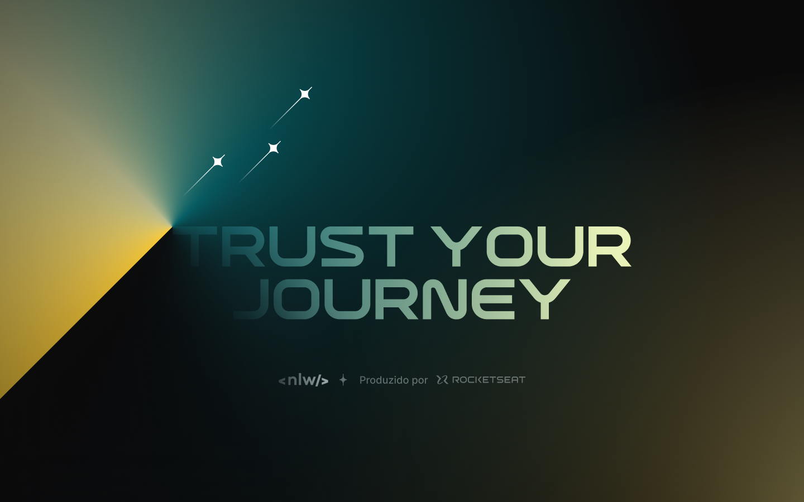

<h1 align="center">NLW Journey - React</h1>

  

## Technologies and Libraries

- Windows 10 Home | 22H2
- [Visual Studio Code | 1.91.0](https://code.visualstudio.com/)
- Node.JS | 20.11.0
- [Vite](https://vitejs.dev/)

## Improvements

- Register link
- List links
- Add new guests
- Change travel location and date
- Validate whether the date of the activity corresponds to the date of the trip

## License

This project is under the MIT license. See the [LICENSE](LICENSE.md) file for more details.